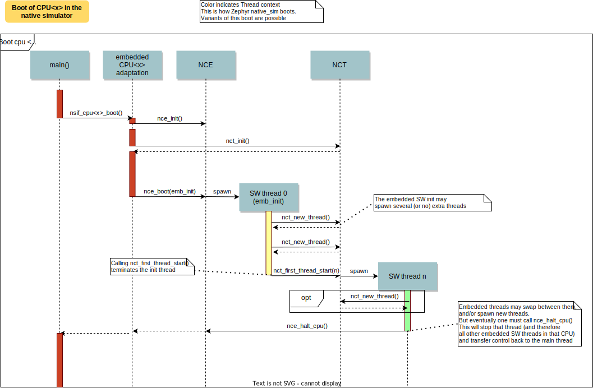
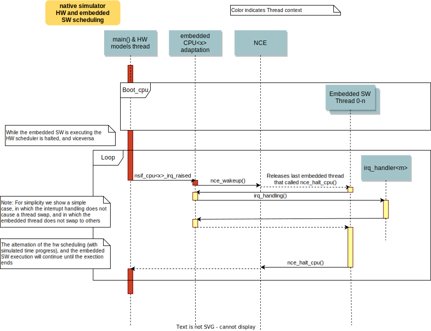
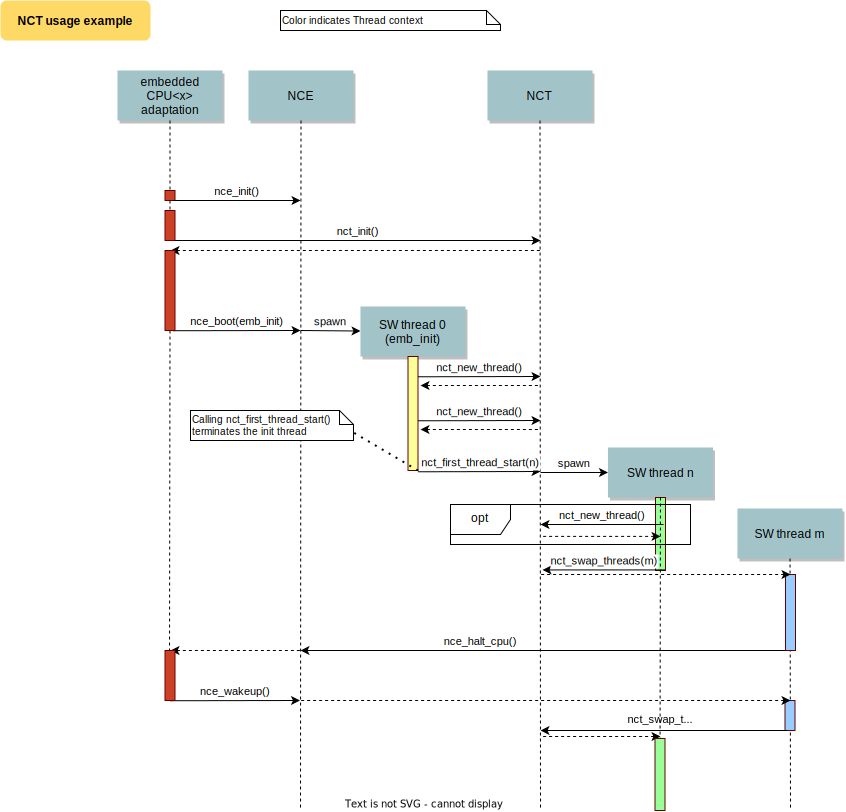

## Introduction

In this document we describe the overall design of the native simulator,
the interfaces it expects and provides to the embedded CPU SW,
how it is [built](#build_anchor), and some integration pointers.

Be sure to read first the overall introduction to the native simulator in [README.md](README.md)

One should understand the native simulator as a glorified workstation test framework for
integration testing of embedded software:
The embedded code is built targeting the development host, just like during unit testing.
But unlike unit testing we aim at building as much as possible of the embedded SW together:
That is, we build the embedded OS (if there is one), the embedded C library (optionally),
the embedded software under test, and the hardware adaptation layers (which probably will require
some changes).

To be able to build this embedded SW, we either also build with it models of the HW, or we instead
build with special embedded drivers that provide the rest of the embedded SW the functionality they
expect, either thru mocks, stubs, HW models, or interaction with the host system.

## Overall execution

When the executable process is started (that is the runner
`main`, which is the linux executable C `main`),
first, early initialization steps are taken care of
(command line argument parsing, initialization of the HW models, etc).

After, the embedded CPUs are started, by calling into the respective embedded CPU libraries
`nsif_cpu<x>_boot()`, and in the meanwhile blocking the starting/main thread.

Here we expect the embedded CPU library to initialize an [NCE](NCE.md) instance, and
use it to spawn a new pthread which will run the embedded CPU SW initialization.

After all CPUs are initialiazed, the original thread will only be used for HW models;
while this newly created threads will be the first "SW" thread in each CPU and start
executing the respective boot of their embedded code.

During this MCU boot process, it is expected that the embedded OS and applications
be initialized, and that their respective "main" threads be spawned and started,
just like in the real embedded target.

As the embedded SW execution progresses, more embedded threads may be spawned.
The expectation here is that the embedded SW adaptation layer will use the [NCT](NCT.md)
which for each embedded thread will create a dedicated Linux pthread.

Eventually the simulated CPU will be put to sleep by the embedded SW
(normally when the boot is completed). This whole simulated CPU boot,
until the first time it goes to sleep happens in 0 simulated time.

At this point the last executing embedded SW pthread will be blocked,
and the first/main thread will be allowed
to execute again. If there is more CPUs to be booted, the process will be repeated for each CPU,
otherwise this main thread will, from now on, be the one handling both the
HW models and the device simulated time.

The HW models are designed around timed events;
this main thread will check what is the next
scheduled HW event, advance simulated time until that point, and call the
corresponding HW model event function.

Eventually one of these HW models will raise an interrupt to a
simulated CPU. When the IRQ controller wants to wake a simulated
CPU, the HW thread is blocked, and the corresponding simulated CPU is awakened by
calling `nsif_cpu<x>_irq_raised()` which is expected to let the last SW thread
continue executing.

This process of getting the CPU to sleep, letting the HW models run,
and raising an interrupt which wakes a CPU again is repeated until the end
of the simulation, while the CPU execution always takes 0 simulated time.

When a SW thread is awakened by an interrupt, it is expected that the
embedded SW adaptation will get the embedded SW to enter the corresponding interrupt handler.

If the SW unmasks a pending interrupt while running, or triggers a SW
interrupt, the interrupt controller may raise the interrupt immediately
depending on interrupt priorities, masking, and locking state.

Interrupts may be executed in the context (and using the stack) of the SW
thread in which they are received, or may be run in a dedicated embedded thread.

To ensure determinism when the embedded code is running,
and to ease application debugging,
the native simulator uses a different time than real time: simulated time.
How and if simulated time relates to the host time, is up to the simulated HW models.

The embedded SW sees the code executing as if the CPU were running at
an infinitely fast clock, and fully decoupled from the underlying host CPU
speed.
No simulated time passes while the embedded code executes.

At the end of the execution, (when something calls `nsi_exit()`, the simulation end time has been
reached, or an error happens), `nsi_exit()` is called, which will call the clean up functions
for HW models, and embedded CPUs' `nsif_cpu<x>_cleanup()`.

### Busy waits

In general, busy waits (infinite loops) in the embedded SW cannot work unless they are modified:
as the code runs without any instrumentation, and no simulated time or HW events occur while
it executes, whatever condition a busy wait loop waits on, will never occur.

For busy wait loops to work, they'll require a minor modification, which, for each iteration
of the loop will call a function which will let simulated time pass.

This can work thanks to functionality provided by the native simulator HW models.
In the case of the basic native model provided, a fake HW timer is dedicated for this task.

When a SW thread wants to busy wait, this fake timer can be programmed in the future time
corresponding to the end of the busy wait and the CPU be put immediately to sleep in
the busy_wait caller context. When this fake HW timer expires the CPU will be waken with
a special non-maskable phony interrupt which does not have a corresponding interrupt handler
but will resume the busy_wait SW execution. Note that other interrupts may arrive while the
busy wait is in progress, which may delay the k_busy_wait() return just like in real life.

Interrupts may be locked out or masked during this time, but the special fake-timer non-maskable
interrupt will wake the CPU nonetheless.

## Native simulator tasks

To ease plugging extra components and HW models to the native simulator, and specially to allow
plugging to it from other libraries which may be linked with it, the native simulator provides
a set of hooks called the NSI_TASKS.

These allow registering (at build/link time) functions which will be called at different stages
during the process execution: Before command line parsing (so dynamic command line arguments
can be registered using this hook), before initialization of the HW models, during HW models
initialization, before the simulated CPUs are started, after the simulated CPUs goes to sleep
for the first time, and when the application exists.

Check [nsi_tasks.h](../common/src/nsi_tasks.h)

Note that the embedded CPU SW has its own hooks, as described in
[nsi_cpu_if.h](../common/src/include/nsi_cpu_if.h).

## The HW scheduling

HW is scheduled by having HW models register their own events and the deadlines for those events.
Events types are registered statically (at build time), with `NSI_HW_EVENT`, with this
HW models can register an event: it's "timer" (a pointer to a 64 bit value which contains
the next time the event is meant to trigger in microseconds since boot),
the callback to be called when the event triggers, and the event priority.
See [nsi_hws_models_if.h](../common/src/include/nsi_hws_models_if.h) for more info.

When a HW model updates an event deadline, it shall call `nsi_hws_find_next_event()`
to notify the scheduler of the possible event update.

The HW scheduler, each time an event is finished, checks what is the next event in time, advances
simulated time until that point, and calls the corresponding callback.

If several events coincide in time, the HW scheduler will in the same time, in different
"delta cycles" call each event callback based on priority.

## Embedded OS adaptation

For simplicity and to ensure deterministic execution,
the native simulator works under the asumption that each simulated embedded MCU is a
single threaded processor. And therefore, only one embedded thread is executed at a time in each of
those MCUs.
(If multiple embedded threads where to execute in parallel in the host OS, their relative execution
would not be controlled, and therefore the overall execution would not be deterministic).

To ease building the embedded OS adaptation, the native simulator includes two components:
* The [CPU Start/Stop Emulation (NCE)](NCE.md)
* and the [single CPU threading emulation (NCT)](NCT.md)

In these figures, you can see some examples of how an embedded CPU is booted,
how the CPU is halted and awakened, as well as how context is switched between embedded threads.

## Expected API in the embedded CPU SW library

The native simulator expects the embedded CPU SW library will provide
a few functions it can use to boot the embedded CPU, interrupt it, and so forth.

Please check the [nsi_cpu_if.h header](../common/src/include/nsi_cpu_if.h), and the
[embedded OS adaptation section](#emb_os_adapt) for more info.

## Build and symbol visibility

Check the description on the top level
[README, Overall way of working, section](README.md#overall_way_of_working)

The library containing the embededd SW for each CPU must be a static library
(either a `.a` or a single `.o`).

To avoid name collisions, it is very recommendable that this library be prelinked
(incremental relocatable link, `-r` option for gcc or clang's linkers).
In this way all internal symbol references will be already resolved.
This also allows doing any other linker specific processing that embedded SW may
require, like ordering or dropping sections, adding linker defined symbols, etc.

To avoid symbol name collisions, before linking the embedded library with the runner,
the native simulator build will "localize" all symbols with "hidden" visibility.
("localizing" a symbol is the equivalent of making it "static" to that embedded library,
that is, limiting its linking scope to that library).
By default symbols have "default" visibility, but you can change that by instructing your
compiler otherwise (for ex. with the `-fvisibility=hidden` option for gcc or clang).
Note that the symbols the native simulator runner will call (those defined in
[nsi_cpu_if.h](../common/src/include/nsi_cpu_if.h))
need to have "default" (i.e. public) visibility, so they are not "localized", and remain
linkable.

If the embedded library is built in this way, only those symbols which were explicitly
marked to have default visibility will be visible/linkable from other libraries or the runner.

After that both the runner library and embedded CPU SW are linked together into an executable.

As the embedded SW library was only prelinked, it will still be linked further. That is the embedded
SW library will have had many unresolved symbols: At the very least those that call into the
native simulator, but maybe also calls into the host libC, or other host libraries you may
want to utilize.
If you want the native simulator to link to extra libraries, or to pass extra options to the
linking stage you can use the build options `NSI_EXTRA_LIBS` and `NSI_LINK_OPTIONS`.
Similarly you can pass extra options for the build/compilation of the native simulator files
themselves or override others. Check the Makefile for more details.

Note that the embedded library should not refer to fixed embedded addresses.
Instead use symbolic addresses (pointers) to refer to peripherals.
Note also that you should not refer to ROM, RAM, or flash addresses; Your linker script should not
try to place sections in particular address ranges.
(unless you are taking care of remaping that memory area in the Linux process virtual memory
in your embedded software adaptation code)

## The "native" HW models and other components

Together with the native simulator, an optional basic set of HW models and facilities are provided.
These allow building a functional runner which includes a system timer HW, a HW counter, RTC,
interrupt controller, tracing/logging facilities, and command line parsing.

These are used by Zephyr's native_sim target board, but can be used by others. Note that their APIs
should not be considered as stable as those of the components in the common folder.

Other, more elaborate integrations of the native simulator are expected to provide their own
versions of these components.
