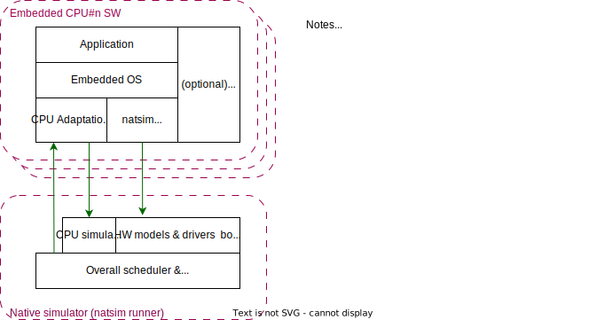
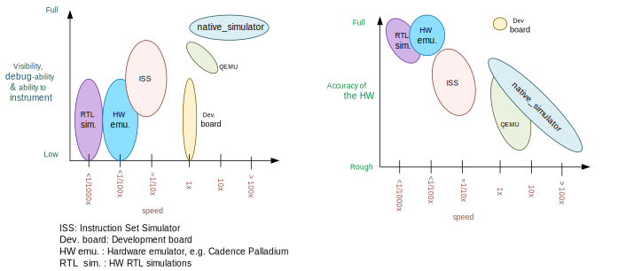

## Introduction

The native simulator is a framework designed to ease running and testing embedded software on
Linux computers.

Unlike tools like QEMU it does not try to run SW images or executables, and does not try to
emulate an instruction set. Instead it helps with building your embedded software natively
for your host, building a normal Linux executable, which runs as a normal Linux process in your
computer.
With this you use native host tools for compiling, debugging, and analyzing your embedded
application, eliminating the need for architecture-specific target hardware in the early
phases of development.

Check the [Rationale section](#Rationale_anchor) for more info regarding why this is a good idea.

The native simulator code is built together with your embedded code.
It provides a bottom layer you can use to build a new HW/CPU adaptation layer for your
embedded SW/embedded OS.
You can find more information in the [Design section](#design_anchor).

<a name="Rationale_anchor"></a>

<a name="overall_way_of_working"></a>

## Overall way of working

When building targeting the native simulator, the embedded software for each MCU (micro-controller)
is built and prelinked as a static library for your host architecture (typically x86/x86-64).

As the embedded software is not built targeting its normal target HW, it will be necessary to do
some changes to it:

* The embedded software will need to be built with a different HW abstraction, specially around the
  OS-CPU abstraction, which, instead of adapting it for a real embedded target (say an ARM Cortex M
  processor and NVIC interrupt controller), it will adapt it to run on Linux.

* Similarly, depending on how good peripheral HW models are available, the peripherals HAL or
  drivers may need replacing, disabling or stubbing.

* A linker script may not be necessary at all, or a custom and cut-down version for use with the
  native simulator may be necessary.

This embedded software library may, optionally, be built with an embededd C library. Otherwise
it can be built using the host C library.

In this library all but a very small subset of symbols are hidden.
This small subset includes just those required to start/stop embedded CPU and interrupt the SW.

The native simulator runner (the code in this repository) is built as a separate library,
and linked to the embedded SW producing the final executable.

The runner is agnostic to any embedded OS, but provides facilities to ease emulating
the CPU start/stop and embedded thread context switching.

The runner also includes the basic facilities for HW models scheduling, some components
which can be used for the embedded software adaptation, as well as a set of basic
"native" HW models which can be used if there is no other HW models, or there is no interest
in modelling any particular target HW.

Much more information can be found in [Design.md](Design.md).



## The native simulator and Zephyr

The [Zephyr RTOS](https://docs.zephyrproject.org/latest/) includes a target board,
[native_sim](https://docs.zephyrproject.org/latest/boards/posix/native_sim/doc/index.html),
which targets the native simulator.

As a Zephyr user you can use this board out of the box to develop and debug your software.

If you are not a Zephyr user, but are considering using the native simulator with your embedded
software you may want to look into how Zephyr is integrated with the native simulator.


## Rationale

The main intents of this native simulator are:

- Allow functional debugging, instrumentation and analysis of the code with
  native tooling.
- Allow functional regression testing, and simulations in which we have the
  full functionality of the code.
- Run tests fast: several minutes of simulated time per wall time second.
- Possibility to connect to external tools which may be able to run much
  faster or much slower than real time.
- Deterministic, repeatable runs:
  There must not be any randomness or indeterminism (unless host peripherals
  are used).
  The result must **not** be affected by:
    - Debugging or instrumenting the code.
    - Pausing in a breakpoint and continuing later.
    - The host computer performance or its load.

The aim of this port is not to debug HW/SW races, missed HW programming
deadlines, or issues in which an interrupt comes when it was not expected.
Normally those would be debugged with a cycle accurate Instruction Set Simulator
(ISS) or with a development board.

### Comparison with other options

This framework does not try to replace cycle accurate instruction set simulators
(ISS), development boards, or QEMU, but to complement them. This tool's main aim
is to meet the targets described in the previous [Rationale section](#Rationale_anchor).


<p align="center"><i>
Comparison of different debugging options.
Note that realism has many dimensions:
Having the real memory map or emulating the exact time an instruction executes is just some of it;
Emulating peripherals accurately is another side.
</i></p>

This native port compiles your code directly for the host architectture
(typically x86), with no instrumentation or
monitoring code. Your code executes directly in the host CPU. That is, your code
executes just as fast as it possibly can.

Simulated time is normally decoupled from real host time.
The problem of how to emulate the instruction execution speed is solved
by assuming that code executes in zero simulated time.

There is normally no I/O or MMU emulation. If you try to access memory through hardcoded
addresses your binary will simply segfault.
The drivers and HW models for this architecture need to hide this from the
application developers when it relates to those peripherals.
In general this tool is not meant to help developing low level drivers for
target HW. But for developing and testing more HW agnostic code or application code.

Your code can be debugged, instrumented, or analyzed with all normal native
development tools just like any other Linux application.

Execution is fully reproducible, you can pause it without side-effects.

#### How does this port compare to QEMU:

With QEMU you compile your image targeting the HW which is closer to
your desired HW. For example an ARM based development kit. QEMU emulates the real memory
layout of the HW, loads the compiled binary and through instructions
translation executes that ARM targeted binary on the host CPU.
Depending on configuration, QEMU also provides models of some peripherals
and, in some cases, can expose host HW as emulated target peripherals.

QEMU normally does not provide any emulation of execution speed. It simply
executes code as fast as it can, and lets the host CPU speed determine the
emulated CPU speed. This produces highly indeterministic behavior,
as the execution speed depends on the host system performance and its load.

As instructions are translated to the host architecture, and the target CPU and
MMU are emulated, there is a performance penalty.

You can connect gdb to QEMU, but have few other instrumentation abilities.

Execution is not reproducible. Some bugs may be triggered only in some runs
depending on the computer and its load.

#### How does this port compare to an ISS:

With a cycle accurate instruction set simulator you compile targeting either
your real CPU/platform or a close enough relative. The memory layout is modeled
and some or all peripherals too.

The simulator loads your binary, slowly interprets each instruction, and
accounts for the time each instruction takes.
Time is simulated and is fully decoupled from real time.
Simulations are on the order of 10 to 100 times slower than real time.

Some instruction set simulators work with gdb, and may
provide some extra tools for analyzing your code.

Execution is fully reproducible. You can normally pause your execution without
side-effects.

<a name="design_anchor"></a>

## Design

Normal embedded SW users or developers will not need to care about the native simulator
implementation details.
Only developers who are interested in integrating their embedded OS or embedded SW
with the native_simulator, or those writing new HW models or drivers for those need to know
about how it works, and how to interface with it.

Information on the native simulator interfaces, internal design, as well as integration
pointers can be found in [Design.md](Design.md).

## License

Please see [LICENSE](./LICENSE)

## Developer Certification of Origin (DCO)

This project requires the Developer Certificate of Origin (DCO)
process to be followed for its contributions.

This is done as a resonable measure to ensure all code in the project
can be licensed under the claimed terms.

By adding a ``Signed-off-by`` line to the commit body message like:
```
   Signed-off-by: John Doe <JohnDoe@somedomain.com>
```
the contributor certifies that he has the right to, and does submit
that patch, under the applicable license, and, that he agrees to the DCO.

The DCO agreement can be found in http://developercertificate.org/, and is
shown below:

```
   Developer Certificate of Origin
   Version 1.1

   Copyright (C) 2004, 2006 The Linux Foundation and its contributors.
   1 Letterman Drive
   Suite D4700
   San Francisco, CA, 94129

   Everyone is permitted to copy and distribute verbatim copies of this
   license document, but changing it is not allowed.

   Developer's Certificate of Origin 1.1

   By making a contribution to this project, I certify that:

   (a) The contribution was created in whole or in part by me and I
       have the right to submit it under the open source license
       indicated in the file; or

   (b) The contribution is based upon previous work that, to the best
       of my knowledge, is covered under an appropriate open source
       license and I have the right under that license to submit that
       work with modifications, whether created in whole or in part
       by me, under the same open source license (unless I am
       permitted to submit under a different license), as indicated
       in the file; or

   (c) The contribution was provided directly to me by some other
       person who certified (a), (b) or (c) and I have not modified
       it.

   (d) I understand and agree that this project and the contribution
       are public and that a record of the contribution (including all
       personal information I submit with it, including my sign-off) is
       maintained indefinitely and may be redistributed consistent with
       this project or the open source license(s) involved.
```